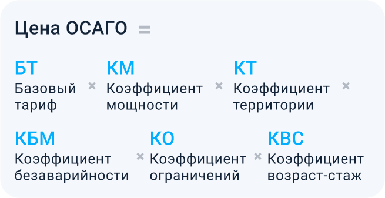
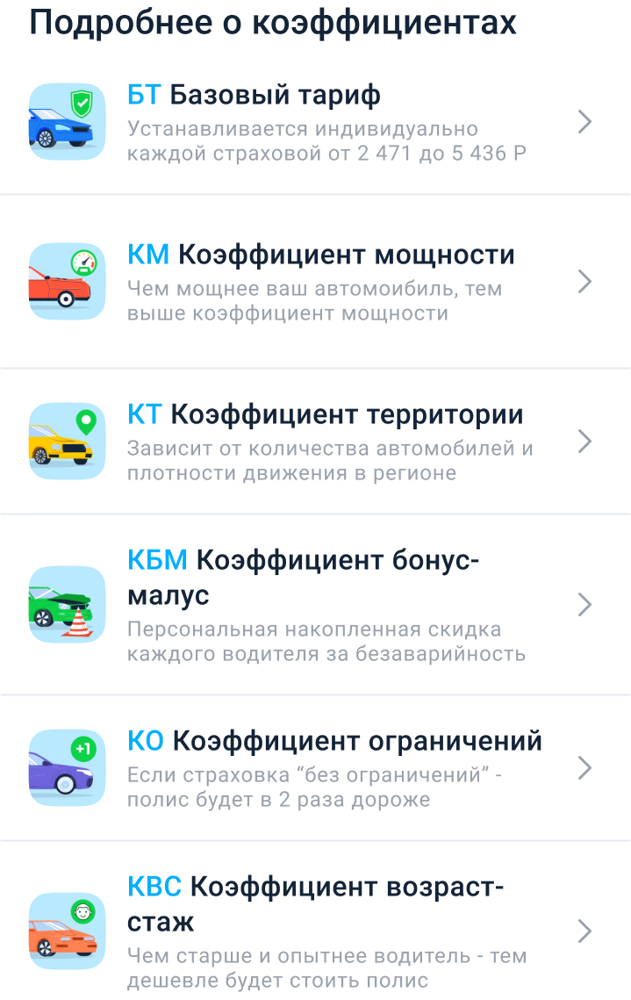
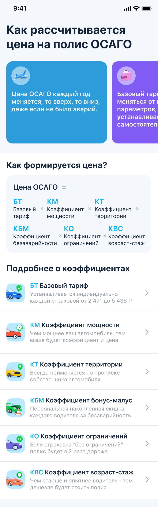

## Задание: Главный экран 

* Создать модуль VIPER для страницы
* Сделать mock данных и реализовать загрузку данных в модели;

---
### Информационные плашки

* Сверстать горизонтальный список с краткой информацией;
* Дизайн и иконки использовать из макетов figma;

---
### Информационный блок формирования цены

* Реализовать компонент "Как формируется цена" с формулой

---
### Секция - подробнее о коэффициентах

* Реализовать список коэффициентов

---
## Вид экрана целиком

* Учесть разную ширину экранов