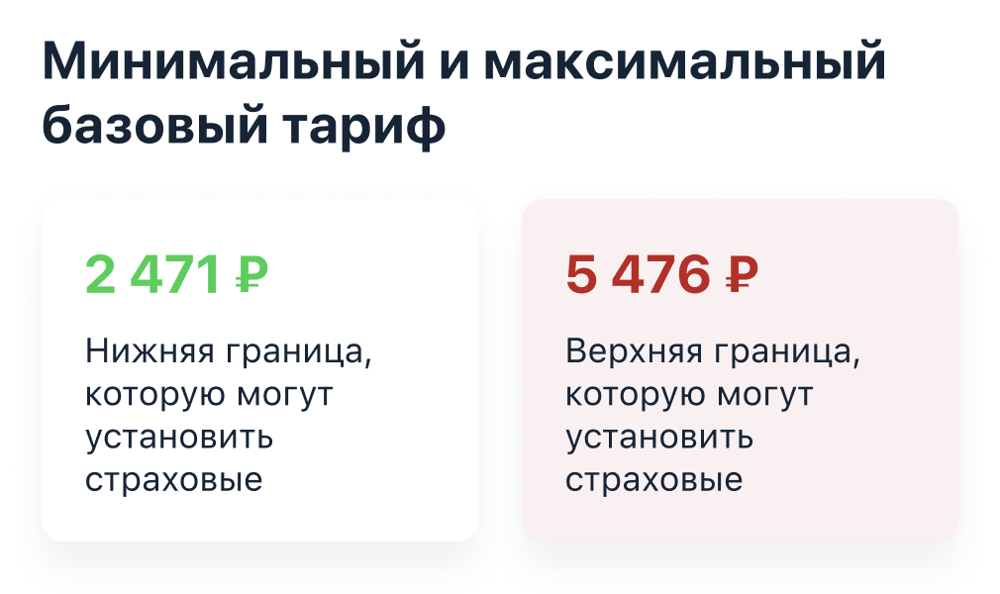
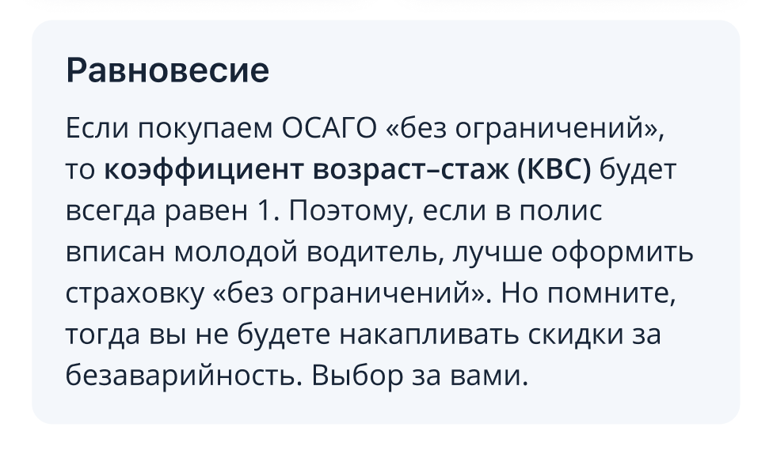

## Задание: Информационный экран с тарифами

* Создать модуль VIPER для страницы;
* Сделать mock данных и реализовать загрузку данных в модели;

---

### Реализовать header с картинкой и title

* Сверстать ячейку;

---
### Реализовать ячейку статичного текста

* Сверстать ячейку;

---
### Реализовать ячейку для списка с буллитами

* Сверстать ячейку;

---
### Реализовать ячейку с тарифом

* Сверстать ячейку;

---

### Реализовать ячейку выбора коэффициента

* Сверстать ячейку;

---

### Реализовать ячейку "Ваш коэффициент"

* Сверстать ячейку;

---

### Реализовать ячейку информационную "Равновесие"

* Сверстать ячейку;

---
### Реализовать ячейку "вернуться на главную"

* Сверстать ячейку;

---

### На основе сверстанных ячеек реализовать один общий экран, для шести наборов данных
     

* Реализовать обновление данных после выбора коэффициента;
