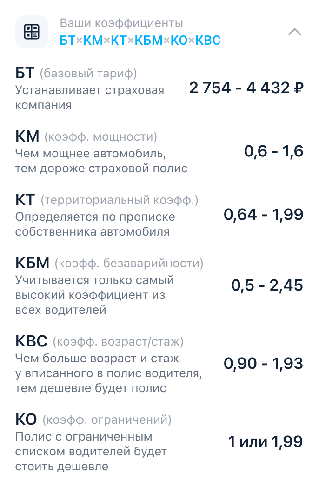

## Задание: Экран ввода данных и расчета тарифа

* Создать модуль VIPER для страницы;
* Сделать mock данных и реализовать загрузку данных в модели;

---
### Реализовать разворачивающуюся ячейку коэффициентов

- Реализовать компонент "Как формируется цена" с формулой;
- Реализовать логику рассчета итоговой цены по выбранным коэффициентам;
---
### Блок ввода данных

-  По нажатию на любое поле открывать новый экран
	- Реализовать экран заглушку
	- При возвращении вставить коэффициент и обновить данные
---
### Состояния экрана при наполнении данными
  

