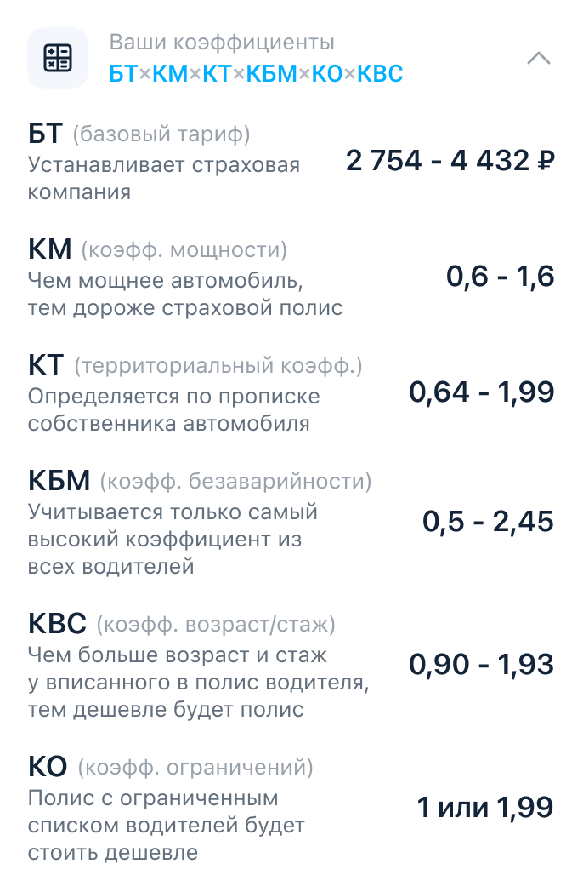

## Задание: Экран с предварительными предложениями

* Создать модуль VIPER для страницы;
* Сделать mock данных и реализовать загрузку данных в модели;

---
### Реализовать разворачивающуюся ячейку коэффициентов

- Реализовать компонент "Ваши коэффициенты" с формулой;
- Реализовать логику рассчета базовой цены по выбранным коэффициентам;

### Реализовать ячейку с страховыми

- Реализовать прилипающую кнопку;
- Реализовать логику расчета страховых компаний по базовым коэффициентам;

### Список страховых компаний
